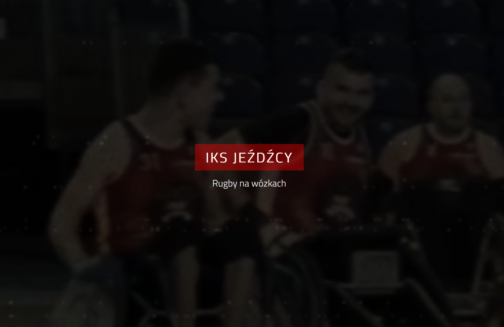
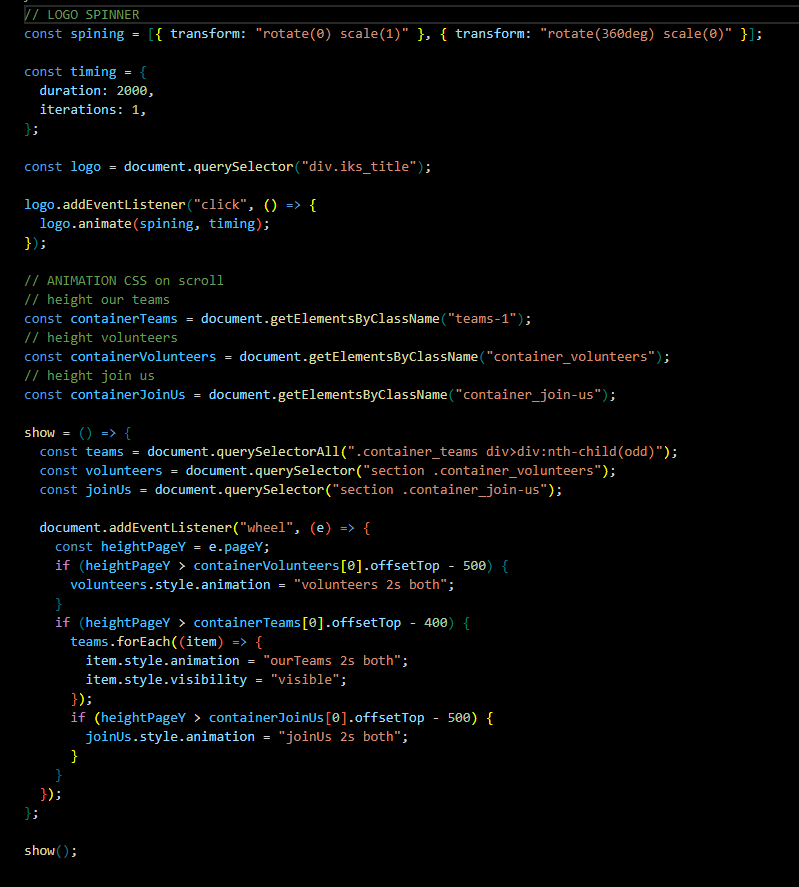

# IKS JEŹDŹCY - Wheelchair Rugby Team simple site

See the live version of [IKS JEŹDŹCY](https://artur-it.github.io/IKS_JEZDZCY-SPA/).

&nbsp;

Very simple site with HTML, CSS and short JavaScript animation code.

This is my private vision of our wheelchair rugby team from Poland.

**Main features**:

- Intro CSS animation
- Mobile and desktop view

&nbsp;

## 💡 Technologies

&nbsp;

## 🤔 Solutions provided in the project

- animation JS + CSS

  
